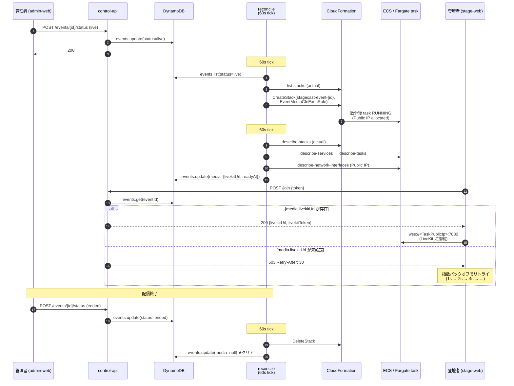

# ADR 0008: LiveKit の Multi-Event 並列配信対応 (per-event URL ルーティング + NLB 廃止)

- ステータス: Accepted（**D-4 NLB 廃止は [ADR 0009](./0009-livekit-tls-signaling-via-nlb.md) で部分撤回 — シグナリング (TCP 7880) は NLB 復活、メディア (UDP 7882 / TCP 7881) は Public IP 直接公開を継承**）
- 日付: 2026-06-17（D-4 部分撤回: 2026-06-19）
- 関連: `DESIGN.md` F-9 / 7.3 / 9 章、
  [ADR 0001](./0001-tech-stack.md)（D-3 メディア層、D-10 シークレット管理）、
  [ADR 0003](./0003-failover.md)（reconcile loop の責務）、
  [ADR 0005](./0005-media-layer-rollout.md)（R1〜R3、D-2 self-hosted）、
  [ADR 0006](./0006-livekit-deployment.md)（**D-1 NLB を本 ADR で上書き**、D-3 config 注入は維持）、
  [ADR 0009](./0009-livekit-tls-signaling-via-nlb.md)（**D-4 NLB 廃止を部分撤回**）、
  [`docs/NEXT_WORK.md`](../NEXT_WORK.md)（R1〜R3 実装中）

## コンテキスト

`DESIGN.md` F-9 は「**最大 3 つの別イベントを同時並行で配信できる**」と要求し、`7.3` で
「SFU・Egress・字幕パイプラインをイベント単位のセットとして起動するため、あるイベントの負荷が
他へ波及しない」と明記している。ADR 0005 D-2 で **self-hosted Fargate** に確定済み。

しかし、現状の制御 API 実装には次のギャップがある：

```ts
// services/control-api/src/usecases/join.ts:81
return {
  ok: true, room, identity,
  livekitUrl: minter.url,   // ← Secret に保存された "単一 URL" を返している
  livekitToken,
};
```

`minter.url` は `stagecast/livekit` Secret の `url` フィールドに 1 つだけ入った値であり、
**per-event の解決ロジックがない**。これは以下の問題を起こす：

- 2 つ以上の `EventMediaStack` が同時に live になっても、登壇者は同じ URL に接続してしまい、
  別イベントの LiveKit に繋ぐ (もしくは Secret の URL が指していないイベントは接続不能)
- 「最大 3」というキャップは **現実的な配信見込み** にすぎず、アーキテクチャ上は LiveKit が
  N 個立てば N 個の独立配信を捌けるべきである

また、ADR 0006 D-1 は **Network Load Balancer (NLB)** を採用したが、本 ADR の per-event
ルーティングと組み合わせて再評価すると、**1 task per event 前提では NLB のメリットがほぼ消える**
(後述 D-4)。

本 ADR では以下を決める：

- **D-1**: LiveKit URL を per-event に解決する DynamoDB スキーマと参照経路
- **D-2**: URL を書き戻す主体は reconcile Lambda (60s tick)
- **D-3**: `/join` は media.livekitUrl を返し、未確定なら 503 + Retry-After
- **D-4**: NLB を廃止し、Fargate task の Public IP を直接公開する (**ADR 0006 D-1 を上書き**)
- **D-5**: API キー/シークレットは全イベント共有 (現状維持、ADR 0006 D-3 と整合)
- **D-6**: 並列上限は configurable soft cap (`MAX_PARALLEL_EVENTS`) + CloudWatch メトリクス
- **D-7**: PR #60 で追加した Settings UI の URL 関連機能は実装 PR で完全削除

## 決定

### D-1. per-event URL は DynamoDB events 行の `media` オブジェクトに保存する

各 `EventMediaStack` が起動完了したとき、その LiveKit Server の WebSocket URL を events 行に
書き込む。`/join` Lambda はこのフィールドを読んでクライアントに返す。

`@stagecast/shared` で次の型を追加する：

```ts
/** EventMediaStack 起動完了後にメディア層が公開する接続情報。 */
export interface EventMediaInfo {
  /**
   * LiveKit Server に登壇者が WebSocket 接続するための URL。
   * `wss://<TaskPublicIp>:7880` 形式 (NLB を経由しない、ADR 0008 D-4)。
   */
  livekitUrl: string;
  /** URL が確定し DynamoDB に書き戻されたエポックミリ秒。診断用。 */
  readyAt: number;
  // 将来: captionApiUrl, alarmTopicArn など EventMediaStack の他出力を追加可能
}

export interface EventDefinition {
  // ... 既存フィールド
  /**
   * EventMediaStack が起動完了した後のメディア層接続情報。
   * status="draft"/"ended" や、live でも起動前なら undefined。
   */
  media?: EventMediaInfo;
}
```

#### 代替案と却下理由

| 代替案 | 却下理由 |
|---|---|
| Per-event Secrets Manager (`stagecast/livekit/{eventId}`) | URL は機密でないため Secret に入れる必然性なし。ADR 0001 D-10 と用途不整合 |
| Route53 + ACM (DNS パターン) | 独自ドメイン取得 + ACM 発行運用が増える。MVP のスコープ外 |
| CloudFormation describe-stack を `/join` から都度叩く | CFN レート制限とレイテンシ (200〜500ms) が `/join` 体験を悪化させる |

DynamoDB は **1〜10ms の参照** で済み、events 行を引くついでで取得できる。

### D-2. 書き込み主体は reconcile Lambda (60s tick)

reconcile loop に次のステップを追加する：

1. (既存) `events.list(status=live)` から desired を取得
2. (既存) `cfn:list-stacks` から actual を取得
3. (既存) desired と actual の差分でアクション計算 (provision / destroy / wait)
4. **(新規)** live なイベントごとに以下を実行：
   - `ecs:describe-services` → `ecs:describe-tasks` で task ARN を取得
   - task の ENI から `ec2:describe-network-interfaces` で Public IP を取得
   - 取得した URL が events 行の `media.livekitUrl` と異なれば `events.update({media})` を呼ぶ
5. (新規) destroy アクション実行時 / status="ended" 遷移時に `media` を `undefined` にクリア
6. (新規) `MAX_PARALLEL_EVENTS` を超える provision は skip (D-6)

#### 代替案と却下理由

| 代替案 | 却下理由 |
|---|---|
| EventBridge ECS Task State Change ルール | ~5s で反映でき魅力的だが、Rule + Lambda + IAM の追加コンポーネント。reconcile と二重の反応経路ができてデバッグが複雑化 |
| EventMediaStack 内の Custom Resource | task readiness 待ちロジックを Custom Resource Lambda 内に組む必要があり、cross-stack の DynamoDB 書き込み権限管理も追加 |

最大 60s の反映遅延は **stage-web の 503 リトライ (D-3)** で吸収できるため、追加インフラを増やさない
reconcile 拡張が最良のトレードオフ。

### D-3. `/join` は media.livekitUrl を返し、未確定なら 503 Service Unavailable + Retry-After

```ts
// services/control-api/src/usecases/join.ts (新)
const event = await events.get(eventId);
if (event.status !== "live") {
  throw new ValidationError("event is not live");
}
if (!event.media?.livekitUrl) {
  // EventMediaStack 起動中 / reconcile がまだ書き戻していない
  throw new ServiceUnavailableError("LiveKit URL not ready", { retryAfterSec: 30 });
}
const livekitToken = await minter.mint({ room, identity, eventId });
return {
  ok: true, room, identity,
  livekitUrl: event.media.livekitUrl,
  livekitToken,
};
```

レスポンスシェイプ (`livekitUrl: string`) は変えないので、stage-web 側の SDK 呼び出しコードは
据え置き。`minter.url` は使われなくなり、`stagecast/livekit` Secret の `url` フィールドは
**廃止 (D-7 で削除)**。

#### stage-web の 503 対応

stage-web は `/join` で 503 を受けた場合、**exponential backoff** でリトライする：

- 待ち時間: 1s → 2s → 4s → 8s → 16s → max 30s
- 累積最大: ~60s (= reconcile tick + ECS Task 起動時間のマージン)
- UI: 「**配信準備中… 最大 60 秒お待ちください**」と進捗表示
- 30s 経っても 200 が来なければエラー画面 + 手動「再試行」ボタン

### D-4. NLB を廃止し、Fargate task の Public IP を直接公開する

**ADR 0006 D-1 で採用した NLB を本 ADR で上書きする。**

> **【部分撤回 (2026-06-19)】** 本 D-4 のうち「シグナリング (TCP 7880) を Public IP で公開する」
> 部分は [ADR 0009](./0009-livekit-tls-signaling-via-nlb.md) で撤回された。HTTPS ページから
> `wss://` 接続には TLS が必須なため、NLB + ACM で TLS 終端する構成に変更されている。
> **メディア (UDP 7882 / TCP 7881) は引き続き Public IP 直接公開** で、本 D-4 のうちメディア
> 部分は維持されている。詳細は ADR 0009 D-1, D-2 を参照。

ADR 0006 D-1 の比較表は **「常時稼働 / 複数 task 前提」** で組まれており、stagecast の
per-event + 1 task per event の実態と乖離している。改めて評価すると：

| 観点 | ADR 0006 D-1 の評価 (NLB 採用) | per-event 実態 (NLB 廃止採用) |
|---|---|---|
| エンドポイント安定性 | NLB DNS が固定で task 入れ替えに追従 | task 単一・イベント 1 回限り。クラッシュ時は Room 状態消失で**どっちみち再入室必須** → 安定性メリット薄い |
| TLS 終端 | 将来 ACM 終端に拡張可 | NLB は標準 TCP パススルー。現在 TLS 終端実装なし → 将来課題 (後述 Out of Scope) |
| UDP (WebRTC media) | UDP リスナで転送 | Public IP でも直接受け取れる。差なし |
| コスト | $0.0225/h ＋ LCU | 並列 N 個ぶん発生 ($0.025 × N × 配信時間)。N=10 で月数 USD 単位だが純粋な overhead |
| 起動時間 | 既存リスト | NLB の deploy が **3〜5 分追加** される。stage-web の 503 リトライ累積時間に直結 |
| Multi-Node | LB 前提で活きる | stagecast 現要件 (~200 人/イベント) では Multi-Node 不要 (後述「将来課題」参照) |

#### EventMediaStack の変更

`infra/lib/event-media-stack.ts` から NLB 関連リソースを削除し、ECS Service の
`assignPublicIp: ENABLED` を有効にする。`SfuNlbDnsName` 出力は削除。

```ts
// infra/lib/event-media-stack.ts (抜粋: 削除対象)
// const nlb = new elbv2.NetworkLoadBalancer(this, "SfuNlb", { ... });   // 削除
// nlb.addListener("Tcp7880", { port: 7880, ... });                       // 削除
// nlb.addListener("Tcp7881", { port: 7881, ... });                       // 削除
// nlb.addListener("Udp7882", { port: 7882, ... });                       // 削除
// new CfnOutput(this, "SfuNlbDnsName", { ... });                         // 削除

// 既存 ECS Service を以下に変更:
const sfuService = new ecs.FargateService(this, "SfuService", {
  // ...既存設定
  assignPublicIp: true,
  securityGroups: [sfuSecurityGroup],  // 7880/7881/TCP + 7882/UDP のみ
});
```

LiveKit Server の `rtc.use_external_ip: true` は **ADR 0006 D-3 に既に含まれている** のでそのまま機能する。

### D-5. API キー/シークレットは全イベント共有 (ADR 0006 D-3 を維持)

`stagecast/livekit` Secret の `apiKey` / `apiSecret` を全 `EventMediaStack` が ECS Secret として
読み取る現状の方式を維持する。

| 理由 | 詳細 |
|---|---|
| 運用簡素 | 鍵ローテーション (PR #60 の `POST /settings/livekit/regenerate`) が 1 回で済む |
| 隔離は別レイヤ | 隔離は **per-event Room + JWT 署名** で実現済み。鍵共有でもイベント間越境不可 |
| ADR 0006 D-3 整合 | `keys` 注入経路 (Secrets → ECS Secret → `LIVEKIT_KEYS` env) を維持 |

per-event 鍵モデルへの移行は **将来課題** とする (後述)。

### D-6. 並列イベント上限は configurable soft cap

`reconcile` Lambda に **`MAX_PARALLEL_EVENTS` 環境変数** (デフォルト 10) を追加する。

- 上限以下: 通常どおり provision
- 上限超過: 警告ログ (`level: warn`, `component: reconcile`, `reason: "cap exceeded"`) を出し、
  超過分の provision を skip。次の tick で再評価
- CloudWatch メトリクス: `Stagecast/Reconcile/ParallelEventCount` (Gauge) を毎 tick 発行

#### DESIGN.md の改定

`DESIGN.md` F-9 / 7.3 / 9 章の「**最大 3 並列**」記述を「**現実的な配信見込みは最大 3 並列**」と
弱める (本 ADR と同時の PR で更新)。

### D-7. PR #60 で追加した Settings UI の URL 関連を実装 PR で削除する

per-event 化により、グローバル設定としての URL は不要になる。実装 PR (本 ADR 採択後の別 PR) で
次を完全削除する：

| 削除対象 | 場所 |
|---|---|
| `PATCH /settings/livekit` エンドポイント | `services/control-api/src/http/app.ts` |
| `patchLiveKitUrl()` usecase | `services/control-api/src/usecases/settings.ts` |
| `patchLiveKitUrl()` クライアントメソッド | `apps/admin-web/src/api/types.ts`, `http-client.ts`, `local-client.ts` |
| `LiveKitForm` の「① URL (NLB DNS)」セクション | `apps/admin-web/src/components/SettingsPage.tsx` |
| `Secrets Manager stagecast/livekit` の `url` フィールド | `infra/lib/control-plane-stack.ts` (`secretStringValue` を `{apiKey, apiSecret}` のみに) |
| `services/control-api/src/usecases/settings.ts` の `LiveKitSettingsStatus.url` | shared 型から `url?: string` を除去 |

**維持する** もの:
- `PUT /settings/livekit` (apiKey/apiSecret 全置換)
- `POST /settings/livekit/regenerate` (鍵再生成)
- `LiveKitForm` の「② API キー / シークレット (サーバ生成)」セクション

## DynamoDB スキーマ詳細

`MetadataTable` の events エンティティ (PK=`EVENT#{eventId}`, SK=`META`) に `media`
属性を追加する。スキーマレスなので migration は不要。

```ts
// @stagecast/shared/src/event.ts (新規追加)
export interface EventMediaInfo {
  livekitUrl: string;   // wss://<TaskPublicIp>:7880
  readyAt: number;      // epoch ms
}

export interface EventDefinition {
  id: string;
  title: string;
  status: EventStatus;
  // ... 既存
  media?: EventMediaInfo;  // ★ 新規
}
```

| ライフサイクル | media の値 |
|---|---|
| `status=draft` | undefined |
| `status=live` + EventMediaStack 未起動 | undefined |
| `status=live` + EventMediaStack RUNNING (reconcile が書き戻し済み) | `{livekitUrl, readyAt}` |
| `status=ended` (reconcile が stack destroy 完了) | undefined にクリア |

`gsi-live` GSI は既存どおり `liveStatus` / `eventId` でクエリするので変更なし。

## シーケンス図



## 受け入れ基準 (シナリオチェックボックス)

実装 PR では以下すべてが PASS すること：

### per-event URL ルーティング
- [ ] 単一イベントを live にしてから ~5 分以内に `/join` が 200 を返す
- [ ] 返ってきた URL が `wss://<TaskAのPublicIp>:7880` 形式 (NLB ドメインではない)
- [ ] 並列でイベント A・B を live にしたとき、それぞれ別の URL が返る
- [ ] イベント A の登壇者は wss://A、イベント B の登壇者は wss://B に繋がる (相互入り混じり無し)

### 503 リトライと UX
- [ ] イベント live 直後 (EventMediaStack 起動中) は 503 + `Retry-After: 30` が返る
- [ ] stage-web が 503 を受けて 1s → 2s → 4s → 8s の exponential backoff でリトライ
- [ ] stage-web が「配信準備中… 最大 60 秒」を表示し、200 受信でメイン画面に遷移
- [ ] 60s 経っても 200 が来ない場合、エラー UI + 手動「再試行」ボタン

### ライフサイクル
- [ ] イベントを ended にすると `events.media` が `undefined` にクリアされる
- [ ] reconcile が ECS task の Public IP 変更 (task replacement) を検知して DynamoDB を更新する
- [ ] events 行の `media.livekitUrl` 更新後、次回 `/join` で新しい URL が返る

### キャップとモニタリング
- [ ] `MAX_PARALLEL_EVENTS=2` で 3 つ目のイベントを live にしたとき、3 つ目の provision が skip される
- [ ] skip 時に `reason: "cap exceeded"` の warn ログが出る
- [ ] CloudWatch メトリクス `Stagecast/Reconcile/ParallelEventCount` が tick ごとに発行される

### NLB 廃止と Settings UI 削除
- [ ] `infra/lib/event-media-stack.ts` から NLB リソース定義が削除されている
- [ ] EventMediaStack の出力に `SfuNlbDnsName` が含まれない
- [ ] Settings ページに URL 入力欄が存在しない
- [ ] `PATCH /settings/livekit` エンドポイントが 404 を返す
- [ ] `stagecast/livekit` Secret に `url` フィールドが含まれない (apiKey / apiSecret のみ)

### 型整合
- [ ] `@stagecast/shared` で `EventDefinition.media?: EventMediaInfo` が公開される
- [ ] `vp run -r typecheck` が通る
- [ ] `LiveKitSettingsStatus` から `url?: string` が削除されている

## セキュリティ考察

### Public IP 直接公開のリスクと対策

NLB 廃止により Fargate task が Public IP で直接公開される。

| リスク | 対策 |
|---|---|
| 不特定多数からのスキャン | Security Group で **TCP 7880 / 7881・UDP 7882 のみ** を許可。SSH 等は閉じる |
| 未認証アクセス | LiveKit Server の signaling は **JWT 認証必須**。未認証接続は LiveKit 側で拒否 |
| LiveKit 脆弱性 | `livekit/livekit-server:latest` の定期更新 + dependabot の `livekit` グループ (ADR 0006 D7 で導入) |
| DDoS | AWS Shield Standard が自動適用 (追加料金なし) |

### 鍵共有モデル (D-5) のリスクと対策

`stagecast/livekit` の `apiKey` / `apiSecret` は全イベント共有なので、漏洩時の影響範囲が
全イベントに及ぶ。

| 対策 | 詳細 |
|---|---|
| 迅速なローテーション | PR #60 で実装した「鍵を生成」ボタンで再生成 → ECS service の force-deployment で取り込み |
| アクセス最小化 | Lambda の `secretsmanager:PutSecretValue` 権限は **対象 2 Secret に限定** (PR #59 で実装済み) |
| 監査 | Secrets Manager の GetSecretValue / PutSecretValue は CloudTrail で記録される |

### media.livekitUrl の機密性

URL は Public IP を含むが、Public IP それ自体は機密ではない。`/join` は招待トークンがあれば
URL を返すため、登壇者には URL が見える設計。これは LiveKit の標準的な接続フローと整合し、
特別なリスクはない。

### TLS 終端は将来課題 (後述「将来課題」参照)

Public IP 公開時点では **WebSocket は wss でなく ws** になる。本 ADR は MVP 動作確認を目的とし、
TLS 終端は別 ADR で扱う。

> **【更新 (2026-06-19)】** TLS 終端は [ADR 0009](./0009-livekit-tls-signaling-via-nlb.md) で
> 「NLB + ACM ワイルドカード証明書 (`*.media.example.com`) によるシグナリング TLS 終端」として
> 実装された。クライアント接続 URL は `wss://event-XXXXXXXX.media.example.com` 形式。

## トレードオフ

| 採用した方針 | 失ったもの |
|---|---|
| URL を DynamoDB に保存 | per-event Secret や Route53 ベースの「将来の拡張性」(必要になれば後で移行可能) |
| reconcile で書き戻し (60s tick) | 即時反映 (~5s) の EventBridge 経路。stage-web の 503 リトライで吸収 |
| NLB 廃止 | DNS 安定エンドポイント。task 単発前提では実害なし |
| 鍵全イベント共有 | per-event 鍵の隔離度。Room + JWT で代替済み |
| soft cap (`MAX_PARALLEL_EVENTS`) | hard cap の確実性。ただし AWS quota が hard limit として残る |

## マイグレーション計画

本 ADR を実装する別 PR (タイトル例: `feat: LiveKit を per-event URL ルーティングに移行`) で
以下を順序立てて実施する：

1. **shared 型** に `EventMediaInfo` と `EventDefinition.media` を追加
2. **reconcile** に media 書き戻しステップを追加 + `MAX_PARALLEL_EVENTS` 実装
3. **control-api `/join`** を `event.media.livekitUrl` 参照に変更 + 503 経路追加
4. **stage-web** の `/join` 呼び出しに exponential backoff + 進捗 UI を追加
5. **infra `event-media-stack.ts`** から NLB 削除、`assignPublicIp: true` に変更
6. **infra `control-plane-stack.ts`** の `stagecast/livekit` Secret から `url` フィールド削除
7. **settings** の URL 関連 (PATCH endpoint, UI, 型) を削除 (D-7)
8. **DESIGN.md** F-9 / 7.3 / 9 章の「最大 3」記述を「現実的な見込み」に改定
9. **ADR 0006** 冒頭に「**D-1 NLB は ADR 0008 で廃止**」のステータス追記

## 将来課題 (Out of Scope)

以下は本 ADR では扱わない。必要になった時点で別 ADR を立てる：

| 課題 | トリガー |
|---|---|
| ~~**TLS 終端** (Public IP に ACM が使えない問題)~~ → [ADR 0009](./0009-livekit-tls-signaling-via-nlb.md) **で対応済み** | ~~本番運用に近づいたタイミング~~ |
| **Per-event 鍵モデル** | 1 イベントの鍵漏洩リスクが顕在化したとき、または規制要件が出たとき |
| **NLB / Route53 復活** | 1 イベントで 1000 人クラスのキャパが必要になり、複数ノード化が要件化したとき |
| **Cross-AZ HA** | 配信の単発障害許容度が厳しくなったとき (現状は task 単一 = AZ 障害でイベント断) |
| **EventBridge ECS Task State Change への移行** | 60s 反映遅延が UX 上問題になり、stage-web リトライで吸収しきれなくなったとき |
